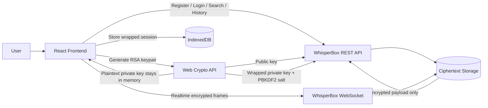

# WhisperBox Secure Chat

End-to-end encrypted messaging frontend for the WhisperBox API.

## Stack

- React + TypeScript + Vite
- Web Crypto API for RSA-OAEP, AES-GCM, and PBKDF2
- IndexedDB for wrapped-session persistence
- REST + WebSocket integration with `https://whisperbox.koyeb.app`

## Run Locally

```bash
npm install
npm run dev
```

The app runs on `http://localhost:4173`.

## Architecture Diagram



## Encryption Flow

### Registration

1. The client generates an RSA-OAEP key pair in the browser.
2. The client generates a PBKDF2 salt.
3. The user password derives an AES-GCM wrapping key with PBKDF2.
4. The RSA private key is wrapped locally with AES-GCM.
5. The frontend sends only:
   - `public_key`
   - `wrapped_private_key`
   - `pbkdf2_salt`
6. The server stores key blobs verbatim and never receives the plaintext private key.

### Login / Unlock

1. The client logs in with username and password.
2. The backend returns the wrapped private key and PBKDF2 salt.
3. The password re-derives the AES-GCM wrapping key locally.
4. The wrapped payload is decrypted and the RSA private key is restored into memory only.
5. The refresh token and wrapped key material are persisted in IndexedDB.
6. On reload, the session can be refreshed, but the user must re-enter the password to unlock the private key again.

### Sending a Message

1. The client fetches the recipient public key.
2. The client generates a fresh AES-GCM message key and IV.
3. The plaintext is encrypted locally with AES-GCM.
4. The AES key is encrypted twice:
   - once with the recipient RSA public key
   - once with the sender RSA public key
5. The frontend sends only the encrypted blob:
   - `ciphertext`
   - `iv`
   - `encryptedKey`
   - `encryptedKeyForSelf`

### Receiving a Message

1. The backend returns ciphertext through REST history or WebSocket delivery.
2. The client chooses the correct wrapped AES key:
   - `encryptedKey` for incoming messages
   - `encryptedKeyForSelf` for the sender's own sent copy
3. The client decrypts the AES key with the in-memory RSA private key.
4. The client decrypts the ciphertext with AES-GCM.
5. If decryption fails, the UI shows a graceful failure state instead of crashing.

## Key Management

- Public key:
  Stored on the backend and fetched before composing messages.

- Private key:
  Generated on the client and never stored in plaintext.

- Wrapped private key:
  Stored by the backend and also persisted indirectly through the authenticated user profile.

- Password-derived wrapping key:
  Re-derived on demand with PBKDF2 and never persisted.

- AES-GCM wrapped private key:
  The PKCS#8 private key is encrypted locally with AES-GCM before it is stored or sent.

- Session persistence:
  Refresh token and user profile are stored in IndexedDB, not `localStorage`.

- Runtime secret scope:
  Plaintext private key exists only in browser memory after login or unlock.

## Security Decisions

- Uses Web Crypto API primitives requested in the brief:
  - AES-GCM for content encryption
  - RSA-OAEP for key exchange
  - PBKDF2 + AES-GCM for private key wrapping

- Avoids raw private key persistence:
  The private key is unwrapped only for the live session.

- Avoids `localStorage` for sensitive session state:
  IndexedDB is used for persisted session metadata instead.

- Uses short-lived access tokens:
  Access tokens are refreshed automatically before expiry.

- Handles decryption failure safely:
  Bad payloads render a warning bubble rather than breaking the thread.

## Security Trade-offs

- The refresh token is persisted in IndexedDB for usability.
  This improves restore behavior, but it is still a sensitive token and would ideally be managed with hardened platform protections or httpOnly cookies if the backend supported them.

- The app uses RSA-OAEP identity keys per user instead of ephemeral session keys.
  This satisfies the assignment and API contract, but it does not provide strong forward secrecy.

- Replay protection is limited.
  Messages include a client-generated nonce inside the encrypted envelope for reconciliation and optimistic UI dedupe, but there is no backend nonce registry or signed anti-replay protocol.

- Trust is browser-based.
  If the browser environment is compromised, E2EE cannot protect the user's local plaintext or unlocked private key.

## Known Limitations

- The WebSocket frame schema is inferred from the backend docs and implemented defensively because the OpenAPI spec does not fully describe event payload envelopes.
- There is no attachment or media encryption flow yet.
- The app currently targets one-to-one direct messaging only.
- Forward secrecy and stronger replay defenses would require backend protocol changes.
- Browser-level visual verification could not be completed in this session because the in-app browser control tool was not exposed, so validation was completed with:
  - successful production build
  - successful live end-to-end API verification on May 4, 2026 against `https://whisperbox.koyeb.app`
  - register, login, refresh, search, public-key lookup, encrypted send, history fetch, and sender/recipient decryption all succeeding with temporary test users

## API Endpoints Used

- `POST /auth/register`
- `POST /auth/login`
- `GET /auth/me`
- `POST /auth/refresh`
- `POST /auth/logout`
- `GET /users/search`
- `GET /users/{userId}/public-key`
- `GET /conversations`
- `GET /conversations/{userId}/messages`
- `POST /messages`
- `wss://whisperbox.koyeb.app/ws?token=<access_token>`

## Submission Notes

- Frontend implements client-side encryption and decryption.
- Backend only receives and stores ciphertext blobs.
- UI includes secure auth, search, conversation history, realtime/fallback delivery behavior, loading states, and decryption failure states.
